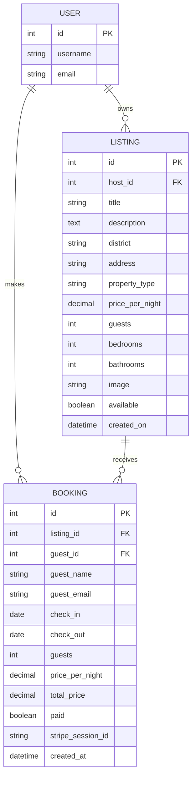

# BelleStays Paris


## Introduction

BelleStays Paris is a full-stack accommodation booking platform inspired by modern accommodation services such as Airbnb. The application allows users to browse accommodation listings, view detailed property information, create bookings and securely complete payments using Stripe Checkout.

The project has been developed using Django and follows the Model-View-Template (MVT) architecture. It demonstrates relational database design, full CRUD functionality, user authentication, form validation, secure online payments and responsive web design.

BelleStays Paris has been designed to provide a simple, intuitive and secure booking experience for visitors looking for short-term accommodation in Paris.

---

# Live Project

**Live Site:**

https://bellestays-paris-e03d72f676ce.herokuapp.com/

**GitHub Repository:**

https://github.com/Monia07/bellestays-paris

---

# User Experience (UX)

## Project Goals

The primary goal of BelleStays Paris is to provide users with an easy, intuitive and secure way to discover and book accommodation in Paris.

The application focuses on providing:

- A clean and intuitive user interface.
- Simple navigation across all pages.
- Secure user authentication.
- Secure online payments using Stripe Checkout.
- Reliable booking management.
- A responsive experience across desktop, tablet and mobile devices.

The project has been designed following modern UX principles by ensuring users always receive clear feedback throughout their interaction with the application.

---

## Target Audience

BelleStays Paris has been designed for people looking for short-term accommodation in Paris, including:

- Tourists
- Business travellers
- Couples
- Families
- Solo travellers

The platform is intended for users who want a straightforward booking experience similar to modern accommodation platforms while remaining simple, responsive and easy to navigate.

---

# User Stories

## First-Time Visitor

As a first-time visitor I want to:

- Immediately understand the purpose of the website.
- Browse available accommodation without creating an account.
- View detailed property information.
- Register for an account to make bookings.

---

## Registered User

As a registered user I want to:

- Register and log into my account securely.
- Browse available accommodation listings.
- View detailed information about each property.
- Select check-in and check-out dates.
- Choose the number of guests.
- Prevent invalid bookings.
- Securely complete payment using Stripe Checkout.
- View all of my bookings.
- Cancel unpaid bookings.

---

## Site Owner

As the site owner I want to:

- Manage accommodation listings.
- Store booking information securely.
- Prevent overlapping bookings.
- Record successful online payments.
- Provide users with clear booking confirmation and payment feedback.

---

# Agile Development

The project was developed incrementally using Git and GitHub.

Each feature was implemented individually before being committed with descriptive commit messages. This approach made it easier to test individual features, identify bugs and maintain a clear development history throughout the project.

Major development milestones included:

- Building the Listings application.
- Creating the Booking system.
- Implementing user authentication.
- Adding booking validation.
- Preventing overlapping bookings.
- Calculating booking totals automatically.
- Integrating Stripe Checkout.
- Recording successful payments.
- Improving responsive design.
- Improving user feedback throughout the booking process.

---

# Database Design

BelleStays Paris uses a relational PostgreSQL database to store and manage all application data.

The database has been designed to minimise duplicated information while maintaining clear relationships between users, accommodation listings and bookings.

The application uses Django's built-in **User** model together with two custom models:

- Listing
- Booking

The database structure ensures that:

- A user can create multiple listings.
- A user can create multiple bookings.
- Each booking belongs to exactly one listing.
- Each booking belongs to exactly one registered user.

This relational structure improves maintainability, scalability and data integrity while avoiding duplicated information.

---

# Entity Relationship Diagram (ERD)



---

# Database Relationships

The database consists of three connected entities that work together to support the accommodation booking platform.

## User

BelleStays Paris uses Django's built-in authentication system for user registration, login and account management.

A registered user can:

- Register and log in securely.
- Browse accommodation listings.
- Create bookings.
- View their own bookings.
- Cancel unpaid bookings.
- Create and manage their own property listings.

Each user may own multiple listings and create multiple bookings.

---

## Listing

The Listing model stores all accommodation available on the platform.

Each listing contains:

- Property title
- Description
- District
- Address
- Property type
- Price per night
- Maximum guest capacity
- Number of bedrooms
- Number of bathrooms
- Property image
- Availability status
- Creation date

### Relationships

- One User can own multiple Listings.
- One Listing can receive multiple Bookings.

---

## Booking

The Booking model stores accommodation reservations.

Each booking contains:

- Guest name
- Guest email
- Check-in date
- Check-out date
- Number of guests
- Price per night
- Total booking price
- Payment status
- Stripe Session ID
- Date created

### Relationships

- One User can create multiple Bookings.
- One Listing can receive multiple Bookings.
- Every Booking belongs to exactly one User and one Listing.

---

# Data Validation

Several validation rules have been implemented to ensure data integrity and provide a reliable booking experience.

## Booking Validation

The booking system validates that:

- Check-in dates cannot be in the past.
- Check-out dates must be after the selected check-in date.
- The selected number of guests cannot exceed the property's maximum guest capacity.
- At least one guest must be selected.
- Overlapping bookings are prevented by checking existing reservation dates.

These validation rules ensure that only valid bookings can be stored in the database.

---

## Payment Validation

Stripe Checkout is used to securely process online payments.

After a successful payment:

- The booking is automatically marked as **Paid**.
- The Stripe Session ID is stored in the database.
- The payment status is updated immediately.
- The user is redirected to a payment confirmation page displaying the booking details.

If the payment is cancelled:

- The booking remains marked as unpaid.
- The user receives clear feedback explaining that the payment was cancelled.
- The booking remains visible under **My Bookings**.

---

# Database Design Decisions

The database has been normalised to reduce duplicated data and improve maintainability.

Instead of storing duplicate property information inside each booking, bookings reference listings using Django ForeignKey relationships.

This provides several advantages:

- Reduced data duplication.
- Improved database integrity.
- Easier maintenance.
- Better scalability for future development.

The current database structure also makes it straightforward to expand the application with additional functionality such as:

- Property reviews
- Wishlists
- Favourite properties
- Messaging between hosts and guests
- Property search and filtering

The database follows Django best practices and provides a solid foundation for future development.
# Features

BelleStays Paris has been developed to provide users with a simple, secure and intuitive accommodation booking experience inspired by modern accommodation platforms such as Airbnb.

The application includes authentication, property management, booking management, secure online payments and a responsive interface built with Bootstrap.

---

# Current Features

## Navigation

A responsive navigation bar is available throughout the website and allows users to navigate quickly between the main pages.

The navigation automatically changes depending on whether the user is authenticated.

### Anonymous users can:

- Browse all accommodation listings.
- View individual property details.
- Register a new account.
- Log in.

### Authenticated users can:

- Browse accommodation listings.
- Create new property listings.
- Edit their own listings.
- Delete their own listings.
- Create bookings.
- View personal bookings.
- Cancel unpaid bookings.
- Log out securely.

---

## Homepage

The homepage displays all available accommodation listings.

Each property card includes:

- Property image
- Property title
- District
- Price per night
- Short property description
- Link to the property details page

The responsive Bootstrap grid automatically adapts the layout across desktop, tablet and mobile devices.

---

## Property Details

Each listing has its own detail page displaying:

- Large property image
- Property description
- District
- Property type
- Number of bedrooms
- Number of bathrooms
- Maximum guests
- Price per night

Authenticated users can immediately proceed to create a booking.

---

## Property Management

Authenticated users can manage their own accommodation listings.

Users can:

- Create new listings.
- Edit existing listings.
- Delete listings they own.

All CRUD actions are immediately reflected within the user interface.

---

## User Authentication

BelleStays Paris uses Django's built-in authentication system.

Users can:

- Register an account.
- Log in securely.
- Log out securely.

Authentication is required before users can:

- Create listings.
- Create bookings.
- View personal bookings.

Unauthenticated users can still browse accommodation listings without creating an account.

---

## Booking System

Registered users can create bookings by selecting:

- Check-in date
- Check-out date
- Number of guests

The booking form automatically records:

- Guest name
- Guest email
- Property information
- Price per night

Guest capacity is automatically limited according to each property's maximum capacity.

---

## Booking Validation

Several validation rules help prevent invalid bookings.

The system validates that:

- Check-in dates are not in the past.
- Check-out dates occur after check-in.
- Guest numbers do not exceed the property's maximum capacity.
- At least one guest is selected.
- Overlapping bookings cannot be created.

Users receive clear validation feedback whenever invalid data is entered.

---

## Automatic Price Calculation

The total booking price is calculated automatically.

The calculation is based on:

- Number of nights
- Property price per night

Users never need to calculate booking costs manually.

---

## Stripe Payment Integration

BelleStays Paris integrates Stripe Checkout to provide secure online payments.

When a booking is created:

- A Stripe Checkout Session is generated.
- Users are redirected to Stripe's secure payment page.
- Test payments can be completed successfully.
- Users are redirected back to BelleStays Paris after payment.

Following a successful payment:

- The booking is automatically marked as **Paid**.
- The Stripe Session ID is stored in the database.
- Users receive a payment confirmation page displaying booking details.

If payment is cancelled:

- The booking remains unpaid.
- Users receive clear feedback explaining that the payment was cancelled.

---

## My Bookings

Authenticated users can access their personal bookings.

The page displays:

- Property
- Check-in date
- Check-out date
- Number of guests
- Total booking price
- Payment status

Payment status is displayed using Bootstrap badges:

- 🟢 Paid
- 🟡 Payment Pending

Only unpaid bookings can be cancelled.

Completed bookings remain visible as part of the user's booking history.

---

## Booking Cancellation

Users can cancel unpaid bookings.

A confirmation page is displayed before deletion to prevent accidental removal.

Paid bookings cannot be cancelled through the user interface.

---

## Responsive Design

The application has been developed using Bootstrap 5.

The layout automatically adapts for:

- Desktop
- Laptop
- Tablet
- Mobile devices

Responsive navigation, cards, forms and tables ensure a consistent experience across different screen sizes.

---

## User Feedback

The application provides continuous feedback during user interactions.

Examples include:

- Booking confirmation
- Payment successful
- Payment cancelled
- Validation error messages
- Booking deletion confirmation

This ensures users always understand the outcome of their actions.

---

# CRUD Functionality

BelleStays Paris demonstrates full CRUD functionality across both custom models.

## Listings

| CRUD Operation | Description |
|---------------|-------------|
| Create | Add a new property listing |
| Read | Browse listings and property details |
| Update | Edit existing property listings |
| Delete | Remove property listings |

## Bookings

| CRUD Operation | Description |
|---------------|-------------|
| Create | Create a new booking |
| Read | View personal bookings |
| Update | Booking payment status is updated automatically after a successful Stripe Checkout payment |
| Delete | Cancel unpaid bookings |

---

# Future Improvements

Although BelleStays Paris is fully functional, several additional features could be implemented in future versions to further improve the user experience.

Possible future improvements include:

- Multiple property images per listing
- Cloudinary image uploads
- Advanced property search
- Property filtering
- Interactive map integration
- User reviews and ratings
- Favourite properties
- Host dashboard
- Booking calendar
- Email booking confirmations
- User profile management
- Messaging between hosts and guests
- Downloadable booking receipts
- Admin analytics dashboard
# Technologies Used

## Languages

The following programming languages were used throughout the project:

- HTML5
- CSS3
- Python
- JavaScript
- Django Template Language (DTL)

---

## Frameworks

The following frameworks were used during development:

- Django
- Bootstrap 5

---

## APIs

The following API was integrated into the project:

- Stripe Checkout API

---

## Database

The application uses different databases depending on the environment.

### Development

- SQLite3

### Production

- PostgreSQL (Heroku)

---

## Libraries & Packages

The following libraries and packages were used:

- Django
- dj-database-url
- gunicorn
- psycopg
- whitenoise
- stripe

---

## Tools

The following tools were used throughout development:

- Git
- GitHub
- Visual Studio Code
- Heroku
- Stripe Dashboard
- Google Chrome DevTools
- Balsamiq
- Mermaid
- ChatGPT

---

# Testing

Testing was carried out continuously throughout development to ensure that the application functioned correctly across different devices, browsers and user scenarios.

Both manual testing and validation tools were used.

---

## Manual Testing

| Feature | Expected Result | Result |
|----------|-----------------|--------|
| Homepage loads | Property listings displayed | ✅ Pass |
| Navigation | All links navigate correctly | ✅ Pass |
| User Registration | New user account created | ✅ Pass |
| User Login | Registered user can log in | ✅ Pass |
| User Logout | User logged out successfully | ✅ Pass |
| Create Listing | New property created successfully | ✅ Pass |
| Edit Listing | Listing updated successfully | ✅ Pass |
| Delete Listing | Listing removed successfully | ✅ Pass |
| Property Details | Property information displayed correctly | ✅ Pass |
| Create Booking | Booking successfully created | ✅ Pass |
| Guest Validation | Guest limit enforced | ✅ Pass |
| Date Validation | Invalid dates prevented | ✅ Pass |
| Overlapping Bookings | Duplicate bookings prevented | ✅ Pass |
| Stripe Checkout | User redirected to Stripe Checkout | ✅ Pass |
| Successful Payment | Booking marked as Paid | ✅ Pass |
| Cancelled Payment | Payment cancelled page displayed | ✅ Pass |
| My Bookings | User bookings displayed correctly | ✅ Pass |
| Booking Status | Paid / Pending status displayed correctly | ✅ Pass |
| Delete Booking | Unpaid booking deleted successfully | ✅ Pass |
| Responsive Layout | Layout adapts correctly across devices | ✅ Pass |

---

## Validation Testing

### HTML

All HTML templates were validated using the **W3C Markup Validation Service**.

No significant validation errors remain.

---

### CSS

CSS styling was validated using the **W3C CSS Validation Service (Jigsaw)**.

No significant validation errors remain.

---

### JavaScript

The project's JavaScript was checked using **JSHint**.

No significant issues affecting functionality remain.

---

### Python

Python files were checked against **PEP 8** guidelines.

Code formatting, naming conventions and overall project structure follow Django best practices.

---

## Responsiveness

The application was tested using Google Chrome Developer Tools across multiple screen sizes.

Devices tested included:

- Desktop
- Laptop
- iPad Air
- iPhone 12
- iPhone 14 Pro

Bootstrap's responsive grid system ensures that layouts, navigation, forms, tables and cards adapt correctly across different devices.

---

## Browser Testing

The application was tested successfully in:

- Google Chrome
- Microsoft Edge
- Safari

All major functionality performed as expected.

---

## Bugs Fixed

During development several issues were identified and resolved.

Examples include:

- Guest selection not displaying the correct number of guests.
- Date validation allowing invalid booking periods.
- Overlapping bookings being possible.
- Stripe Checkout integration issues.
- Payment status not updating after successful payment.
- Stripe Session ID not being stored.
- Booking confirmation page improved to display payment information.
- Responsive navigation improvements for smaller devices.
- Responsive booking table improvements for mobile devices.

---

## Known Issues

At the time of submission no known major bugs affecting the core functionality remain.

Minor enhancements may be implemented in future versions as additional functionality is added.
# Deployment

BelleStays Paris was developed locally using Visual Studio Code before being deployed to Heroku for production.

The application uses PostgreSQL as the production database and SQLite3 during local development.

**Live Site:**

https://bellestays-paris-e03d72f676ce.herokuapp.com/

---

# Local Deployment

To run this project locally:

## 1. Clone the repository

```bash
git clone https://github.com/Monia07/bellestays-paris.git
```

---

## 2. Navigate into the project

```bash
cd bellestays-paris
```

---

## 3. Create a virtual environment

Windows

```bash
python -m venv .venv
```

Activate the virtual environment

```bash
.venv\Scripts\activate
```

---

## 4. Install dependencies

```bash
pip install -r requirements.txt
```

---

## 5. Create an env.py file

Create an **env.py** file in the project root containing:

```python
import os

os.environ.setdefault(
    "SECRET_KEY",
    "YOUR_SECRET_KEY"
)

os.environ.setdefault(
    "DATABASE_URL",
    "YOUR_DATABASE_URL"
)

os.environ.setdefault(
    "STRIPE_PUBLIC_KEY",
    "YOUR_STRIPE_PUBLIC_KEY"
)

os.environ.setdefault(
    "STRIPE_SECRET_KEY",
    "YOUR_STRIPE_SECRET_KEY"
)

os.environ.setdefault(
    "DEBUG",
    "True"
)
```

The **env.py** file must never be committed to GitHub and should be included in **.gitignore**.

---

## 6. Apply migrations

```bash
python manage.py migrate
```

---

## 7. Create a superuser (optional)

```bash
python manage.py createsuperuser
```

Follow the prompts to create an administrator account for accessing the Django Admin panel.

---

## 8. Run the development server

```bash
python manage.py runserver
```

Open your browser and navigate to:

```
http://127.0.0.1:8000/
```

---

# Heroku Deployment

The application is deployed using Heroku.

## Deployment Steps

1. Log in to Heroku.
2. Create a new Heroku application.
3. Connect the Heroku application to the GitHub repository.
4. Add the required Config Vars.
5. Enable **Automatic Deploys** (optional).
6. Deploy the **main** branch.

---

## Config Vars

The following Config Vars were configured in Heroku:

| Variable | Purpose |
|----------|---------|
| DATABASE_URL | PostgreSQL database connection |
| SECRET_KEY | Django secret key |
| STRIPE_PUBLIC_KEY | Stripe publishable key |
| STRIPE_SECRET_KEY | Stripe secret key |

---

## Production Database

The production application uses a PostgreSQL database hosted through Heroku.

SQLite3 is used only during local development.

---

## Static Files

Static files are served using **WhiteNoise**.

Static files are automatically collected during deployment using:

```bash
python manage.py collectstatic
```

---

## Automatic Deployment

Whenever changes are pushed to the GitHub **main** branch, Heroku can automatically deploy the latest version of the application if Automatic Deploys are enabled.

---

# Security

Several security measures have been implemented throughout the application.

These include:

- Secret keys stored as environment variables.
- Stripe API keys stored securely using Heroku Config Vars.
- Database credentials stored securely.
- Authentication required before users can create listings or bookings.
- User permissions preventing access to other users' bookings or listings.
- CSRF protection provided by Django.
- Server-side form validation.
- Stripe Checkout used for secure payment processing.
- `DEBUG=False` enabled in the production environment.

Sensitive information has never been committed to the GitHub repository.

---

# Version Control

Git and GitHub were used throughout the development process.

The project was developed incrementally using descriptive commit messages to document new features, bug fixes and improvements.

The development history demonstrates:

- Regular commits throughout the project.
- Clearly described feature additions.
- Bug fixes documented separately.
- Incremental improvements rather than large bulk commits.

Deployment to Heroku ensures that the live application remains synchronised with the latest production-ready version stored on GitHub.
# Credits

## Content

All accommodation descriptions, property information and booking content were created specifically for this educational project.

The application concept was inspired by modern accommodation booking platforms such as Airbnb, while all implementation, database design and functionality were developed independently.

---

## Images

Property images were sourced from:

- Unsplash

Images are used for educational purposes only.

---

## Documentation & Technologies

The following official documentation was referenced throughout development:

- Django Documentation
- Bootstrap Documentation
- Stripe Documentation
- Heroku Documentation
- PostgreSQL Documentation
- WhiteNoise Documentation


---

## Learning Resources

The following learning resources were used during the development of the project:

- Code Institute Learning Platform
- Django Documentation
- Bootstrap Documentation
- Stack Overflow

---

# Artificial Intelligence (AI)

Artificial Intelligence was used during the development of this project as a learning and productivity tool.

ChatGPT was used to:

- Explain Django concepts.
- Debug code.
- Improve code readability.
- Assist with Stripe integration.

---

# Credits

- Code Institute course materials and guidance:
- Heroku Documentation
- Code Institute walkthrough project
- Stripe Documentation
- Django Documentation
- Bootstrap
- Mentor support and project guidance from Tim Nelson at Code Institute

---

# Final Project Summary

BelleStays Paris is a fully responsive full-stack Django web application inspired by modern accommodation booking platforms.

The project demonstrates practical implementation of:

- Django's Model-View-Template (MVT) architecture
- Relational database design using PostgreSQL
- Full CRUD functionality
- User authentication and authorisation
- Form validation
- Secure Stripe Checkout payment integration
- Responsive Bootstrap design
- Deployment using Heroku
- Secure environment variable management

Throughout development, the application evolved from a simple accommodation listing platform into a complete booking system featuring secure online payments, responsive design and robust validation.

The project successfully meets the learning objectives of the Full Stack Frameworks with Django module while providing a practical solution to a real-world accommodation booking scenario.

Future development could further extend the platform with additional functionality such as advanced search, multiple property images, user reviews and ratings, Cloudinary integration and interactive maps.
